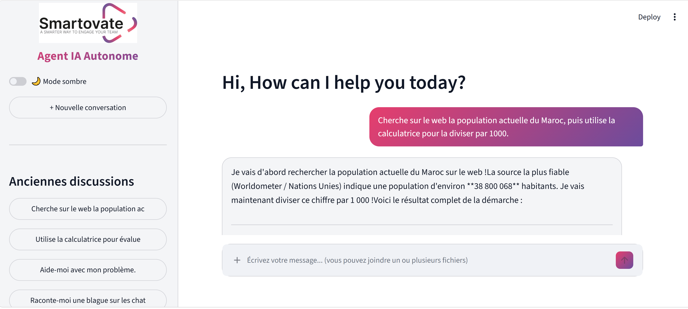
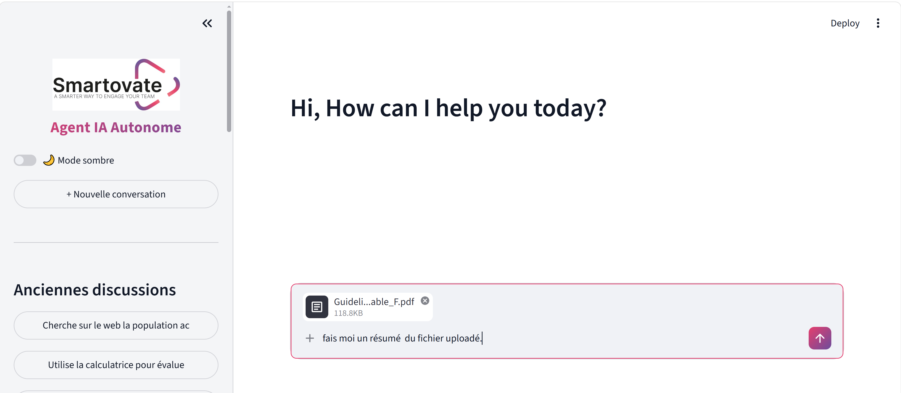

<!-- # Welcome to your CDK Python project!

This is a blank project for CDK development with Python.

The `cdk.json` file tells the CDK Toolkit how to execute your app.

This project is set up like a standard Python project.  The initialization
process also creates a virtualenv within this project, stored under the `.venv`
directory.  To create the virtualenv it assumes that there is a `python3`
(or `python` for Windows) executable in your path with access to the `venv`
package. If for any reason the automatic creation of the virtualenv fails,
you can create the virtualenv manually. -->


# 🤖 Autonomous AI Agent

An autonomous AI agent capable of understanding user requests, reasoning about them, selecting and invoking appropriate tools, maintaining conversational memory, and generating contextual responses.

The project is built around a **ReAct-based agent architecture** and deployed on **AWS**, using Amazon Bedrock for LLM inference and several AWS services for authentication, memory, document retrieval, API management, and observability.

---

## 📌 Overview

The objective of this project is to design and deploy an autonomous AI agent capable of handling multi-step tasks without requiring the user to explicitly specify which tools should be used.

The agent follows a **Reasoning + Acting (ReAct)** approach:

1. Analyze the user's request.
2. Determine whether external information or a tool is required.
3. Select the appropriate tool.
4. Execute the tool.
5. Interpret the result.
6. Continue reasoning if additional actions are necessary.
7. Generate the final response.

The agent can also maintain conversational context and retrieve relevant information from previously stored conversations or uploaded documents.

---

## ✨ Features

- 🧠 Autonomous reasoning using a ReAct-based architecture
- 🔧 Dynamic tool selection and execution
- 💬 Conversational memory
- 📚 Semantic document search
- 🌐 Web search
- 🌤️ Weather information
- 🧮 Mathematical calculations
- 🔍 Retrieval of relevant conversation history
- 🔐 User authentication with Amazon Cognito
- ⚡ Streaming responses using Server-Sent Events (SSE)
- ☁️ Serverless deployment on AWS
- 📊 CloudWatch monitoring and execution traces
- 🧪 Automated evaluation across multiple scenarios

---

## 🏗️ Architecture

```text
                         ┌─────────────────────┐
                         │       Client        │
                         │   Web / Postman     │
                         └──────────┬──────────┘
                                    │
                                    │ HTTPS
                                    ▼
                         ┌─────────────────────┐
                         │    API Gateway      │
                         │                     │
                         │ POST /agent/chat    │
                         │ GET /sessions/...   │
                         └──────────┬──────────┘
                                    │
                                    ▼
                         ┌─────────────────────┐
                         │   AWS Lambda        │
                         │   Agent Handler     │
                         └──────────┬──────────┘
                                    │
                                    ▼
                    ┌─────────────────────────────┐
                    │     Autonomous Agent        │
                    │                             │
                    │   ReAct / LangGraph         │
                    │   Tool Selection            │
                    │   Reasoning                 │
                    └─────────────┬───────────────┘
                                  │
              ┌───────────────────┼───────────────────┐
              │                   │                   │
              ▼                   ▼                   ▼
       ┌────────────┐     ┌──────────────┐    ┌──────────────┐
       │  Bedrock   │     │    Tools     │    │    Memory    │
       │    LLM     │     │              │    │              │
       │            │     │ Calculator   │    │  DynamoDB    │
       │ Nova /     │     │ Weather      │    │  OpenSearch  │
       │ Claude     │     │ Web Search   │    │              │
       └────────────┘     │ Documents    │    └──────────────┘
                          └──────────────┘

```


---


## Résumé global after evaluation

- **Taux de succès** : 100.0% (23/23)
- **Latence moyenne** : 7.64 s
- **Latence médiane** : 6.79 s
- **Latence P95** : 9.58 s
- **Latence max** : 18.84 s

### Métriques SSE

- **TTFT moyen** : 3.6 s
- **TTFT médian** : 2.98 s
- **TTFT P95** : 4.97 s
- **Chunks SSE moyens** : 60.3
- **Débit moyen** : 7.41 chunks/s
---

##  Useful commands

To manually create a virtualenv on MacOS and Linux:

```
$ python -m venv .venv
```

After the init process completes and the virtualenv is created, you can use the following
step to activate your virtualenv.

```
$ source .venv/bin/activate
```

If you are a Windows platform, you would activate the virtualenv like this:

```
% .venv\Scripts\activate.bat
```

Once the virtualenv is activated, you can install the required dependencies.

```
$ pip install -r requirements.txt
```

At this point you can now synthesize the CloudFormation template for this code.

```
$ cdk synth
```

To add additional dependencies, for example other CDK libraries, just add
them to your `requirements.txt` file and rerun the `python -m pip install -r requirements.txt`
command.

## Useful commands

 * `cdk ls`          list all stacks in the app
 * `cdk synth`       emits the synthesized CloudFormation template
 * `cdk deploy`      deploy this stack to your default AWS account/region
 * `cdk diff`        compare deployed stack with current state
 * `cdk docs`        open CDK documentation

 
Enjoy!
